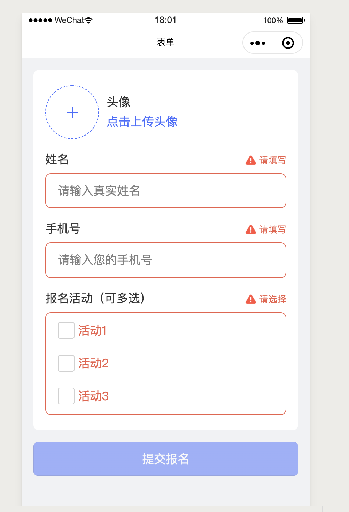

# taro-weapp-form

### Preview



### Demo
无

### Usage

```
...
  import XXForm from '../../components/forms/index'
  import './index.scss'
  import '../../components/forms/form.scss'
...
  render () {
    const { fieldMetas, fieldValues } = this.state;
    return (
      <View>
        <XXForm
          className="xx-form"
          onSubmit={this.submitForm.bind(this)}
          fieldMetas={fieldMetas}
          fieldValues={fieldValues}
          buttonText="提交报名"
        >
        </XXForm>
      </View>
    )
  }
```

### Props

```
  state = {
    fieldMetas: [
      {
        label: '头像',
        type: 'upload',
        actionLabel: '点击上传头像',
        name: 'avatar',
        shape: 'circle',
        rules: [
          {
            required: true,
            message: '请上传',
            trigger: 'change'
          },
        ]
      },
      {
        label: '姓名',
        type: 'text',
        name: 'name',
        attrs: {
          placeholder: '请输入真实姓名',
        },
        rules: [
          {
            required: true,
            message: '请填写',
            trigger: 'blur'
          },
          {
            min: 0,
            max: 30,
            message: '长度30个字符之内',
            trigger: 'blur'
          }
        ]
      },
      {
        label: '手机号',
        type: 'number',
        name: 'telphone',
        attrs: {
          placeholder: '请输入您的手机号',
        },
        rules: [
          {
            required: true,
            message: '请填写',
            trigger: 'blur'
          },
          {
            min: 0,
            max: 30,
            message: '长度30个字符之内',
            trigger: 'blur'
          }
        ]
      },
      {
        label: '个人简介',
        type: 'textarea',
        name: 'introduce',
        config: {
          disabled: false,
        },
        attrs: {
          placeholder: '输入个人简介以便让别人更了解自己',
        },
        rules: [
          {
            required: true,
            message: '请填写',
            trigger: 'blur'
          },
          {
            min: 0,
            max: 500,
            message: '长度500个字符之内',
            trigger: 'blur'
          }
        ]
      },
      // {
      //   label: '任职公司/机构',
      //   type: 'text',
      //   name: 'company',
      //   attrs: {
      //     placeholder: '请输入所属公司名称',
      //   },
      //   rules: [
      //     {
      //       required: true,
      //       message: '请填写',
      //       trigger: 'blur'
      //     },
      //     {
      //       min: 0,
      //       max: 30,
      //       message: '长度30个字符之内',
      //       trigger: 'blur'
      //     }
      //   ]
      // },
      // {
      //   label: '职位',
      //   type: 'text',
      //   name: 'job',
      //   attrs: {
      //     placeholder: '请输入您担任的职务',
      //   },
      //   rules: [
      //     {
      //       required: true,
      //       message: '请填写',
      //       trigger: 'blur'
      //     },
      //     {
      //       min: 0,
      //       max: 30,
      //       message: '长度30个字符之内',
      //       trigger: 'blur'
      //     }
      //   ]
      // },
      {
        label: '报名活动（可多选）',
        type: 'checkbox',
        name: 'activities',
        options: [
          {
            checked: false,
            label: '活动1',
            value: '1',
          },
          {
            checked: false,
            label: '活动2',
            value: '2',
          },
          {
            checked: true,
            label: '活动3',
            value: '3',
          },
        ],
        rules: [
          {
            required: true,
            message: '请选择',
            trigger: 'change'
          }
        ]
      }
    ],
    fieldValues: {
      // 初始值
    }
  };
```

### 说明

* 目前只支持`blur`、`input`、`change`事件触发校验；
* 目前只支持`input`、`textarea`、`image`、`checkbox`表单组件；
* 校验规则同`Vue`表单；
* 上传图像的话，需要在`src/components/forms/form-item/index.js`下修改`afterUpload`逻辑，未提出
